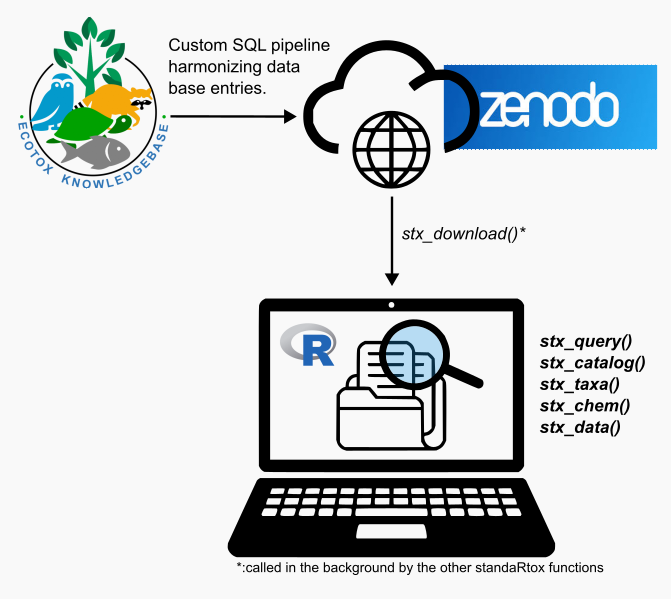

  
----
  
## Setting up your R environment
  
### Installing packages
First, we need to install the *standaRtox* package for R. Usually R-packages are easily installed from the CRAN server via `install.packages()`. However, the NEW and working *standaRtox* version is currently only available on [Github](https://github.com/andschar/standartox). 

This can be easily done by running the `install_github` command from the `remotes` package.
```{r, eval=FALSE}
# CRAN Server installation code example
# install.packages("standartox") # CRAN version <-- currently not available!

# Currently only available on GitHub
install.packages("remotes") # <- we need this package for github installation
remotes::install_github('andschar/standartox') # github version
```

The *standaRtox* package depends on the `data.table` package, which is a powerful R-package for efficient data manipulation. It is required to make the *standaRtox* package work properly. If you don't have it installed, the following code will handle it.
```{r, eval=FALSE}
# We can write this in a single line of code as well like this:
install.packages("data.table")
```

Later on in this course we will depend on a few more R packages. Let's install them as well.
```{r, eval=FALSE}
install.packages("dplyr")
install.packages("ggplot2")
```

### Loading packages
Once we have the required R packages installed, we must load them into our current R session. It is good practice to load all required packages at the beginning of your R script. This way, you can easily see which packages the script depends on.
```{r, eval=TRUE}
# Load the necessary packages for this analysis
library(standartox)
library(data.table)
library(dplyr)   # A helpful package for data filtering and aggregation
library(ggplot2) # A powerful data plotting package
library(forcats) # For reordering factor levels
# with this line we will load custom plotting functions built for this course
source("src/custom_plot_FUN.R")
```

----

## The StandaRtox Architecture

The image below gives you an overview of how *standaRtox* is set up and operates.


Basically, the R package downloads and loads related data table files (~ relational data base) from [this Zenodo Page](https://doi.org/10.5281/zenodo.3785030). These files originate from the [EPA ECOTOX Knowledgebase](https://cfpub.epa.gov/ecotox/explore.cfm) and were consolidated and harmonized through a custom pipeline designed by Andreas Scharmüller. They are the backbone of *standaRtox*.

For more details, see the initial *standaRtox* publication by [Scharmüller et al. (2020)](https://www.mdpi.com/2306-5729/5/2/46).


----

## The StandaRtox Functions

Before we dive into the fun of running queries with *standaRtox*, let's first go over the main functions of this package. It will help us to understand how the package itself works and how we can make the most of it.

These are the main *standaRtox* functions:
  
- `stx_download()`: The backbone of everything; downloads the database.
- `stx_catalog()`: Gets the standaRtox data catalog.
- `stx_taxa()`: Gets a list of all taxonomic groups in the database.
- `stx_chem()`: Gets a list of all chemicals available in the database.
- `stx_data()`: Gets a list of all reported endpoints/results in the database.
- `stx_query()`: **The main function to query the database.**
  
----
  
### stx_download()
The backbone of any database query is the database itself. The *standartox* package does not come with a built-in database.
Instead, it provides a function to download the StandaRtox relational data tables from [Zenodo.org](https://doi.org/10.5281/zenodo.3785030).

These relational data tables are stored in a specific directory on your computer, which is defined by the `stx_dir` parameter. The default directory is a temporary directory on your system.

The output of `stx_download()` is a list of objects (mostly data tables) which correspond to the downloaded and imported files. 

We will now use `stx_download()` and name its output *'stxDb'*. Under this name, the list object can be found in our R Environment.
```{r, eval=FALSE}
# By default, standartox will download the database into a temporary directory:
file.path(tempdir(), "standartox")

# The following code will store your Db files in that temporary directory
# Setting 'silent = FALSE' makes the function verbose, printing its progress.
# The ::: operator is a special tool that lets you bypass the package's public interface and access these internal, non-exported functions directly.
stxDb <- standartox:::stx_download(silent = FALSE)
# If you get an ERROR 407, try to re-run the command
```

If the download was successful, we should now find the files in our local file system. Let's check that with the `list.files` function. 
```{r, eval=FALSE}
list.files(file.path(tempdir(), "standartox"))
```

You can inspect the structure of the `stxDb` list object further within your RStudio IDE simply via the `View()` command:
```{r, eval=FALSE}
View(stxDb)
```

If you wish to keep the standartox database files permanently on your device, you can specify any directory on your system. This might be useful if you need to work offline (e.g., traveling with Deutsche Bahn xD).
```{r, eval=FALSE}
# To keep the downloaded database permanently, specify a storage directory.
local_stx_dir <- "./standartox_db"
stxDb <- standartox:::stx_download(silent = FALSE, stx_dir = local_stx_dir)
```

We can quickly check for our files under our specified file path in the variable `local_stx_dir` using `list.files` again. This time we use `full.names = TRUE` which returns the full file path.
```{r, eval = FALSE}
list.files(local_stx_dir, full.names = TRUE)
```

----

### The main operating logic

Before running any query, *standaRtox* will first check if it can find the required data table files on your local system (in the directory specified by `stx_dir`). If it finds the files, it will not download them again from Zenodo.

From now on, *standaRtox* will run all your queries directly on your local file system. This makes things much quicker without the need to re-download information. 

**The good news is that we don't have to use `stx_download()` ourselves if we wish to query the standaRtox database!** This function is embedded in the subsequent functions. So, to keep your life simple, you can just use `stx_query()` and the other functions directly.

----
  
### stx_catalog()
This function retrieves a catalog of all possible values for variables that can be used for filtering in the `stx_query` call. This is useful for discovering valid inputs for parameters like `endpoint_group`, `effect`, etc.

To get a data catalog, simply run:
```{r, eval=FALSE}
catalog <- stx_catalog()
```

Use `str(catalog)` or `View(catalog)` to inspect its content. It is a named list of data tables. Each data table in the list is named after a column of values which is returned by `stx_query()`.

```{r, eval=FALSE}
catalog_names <- names(catalog)     # Get the names of all objects in catalog
View(as.data.frame(catalog_names))  # Display as a data frame to facilitate the search
```

For example if you are interested to know which kind of `endpoint`, `concentration_unit` or `measurement` types can be found in the data base you can view them like this.
```{r, eval=FALSE}
catalog$endpoint
catalog$concentration_unit
catalog$measurement
```
Using `View()` allows you to use the search bar in your R Studio IDE. (e.g. `View(catalog$endpoint)`)

----
  
### stx_taxa()
If you want to know which taxonomic groups are represented in the database or if you are looking for a specific organism, you can use `stx_taxa()`.

```{r, eval=FALSE}
taxa.dt <- stx_taxa()
View(taxa.dt)
```

Within your RStudio IDE, you can use the search bar in the top-right corner of the data viewer to find what you're looking for.

----

### stx_chem()
If you are interested in which chemicals are listed, you can use `stx_chem()` to directly access this information. 
```{r, eval=FALSE}
chem.dt <- stx_chem()
View(chem.dt)
```
Note that there are `cas`, `common_name`, and `chem_name` columns, which can be used to find the chemicals you might be looking for. 

----

### stx_data()
If you are already advanced in data mining with R, you might be interested in the `stx_data()` function. This will load all ~1.2 million entries from the database.

```{r, eval=FALSE}
tox.dt <- stx_data()
```

**We do not recommend using `stx_data()` when searching for specific content.** Instead, we highly recommend using `stx_query()`, which was specifically developed to help you filter the database efficiently.

---

### **stx_query()** 
One function to rule them all - `stx_query()`! This is the main function of the *standaRtox* package.

You can inspect the full documentation of the function and all of its parameters by running:
```{r, eval=FALSE}
?stx_query
```

The function acts as a powerful front-end for subsetting the database based on chemical, experimental, and taxonomic criteria designed by the user. 

The function operates in a sequential process:

1.  It first downloads the necessary data tables (if not already present).
2.  It performs an initial, fast filtering based on `endpoint_group`, `endpoint_qualifier`, and `duration_unit`.
3.  It then appends chemical and taxonomic information, filtering by `cas_number` and the `tax_*` parameters.
4.  Finally, it applies the remaining experimental filters (`effect`, `duration`, `concentration_unit`, etc.).


By default, `stx_query()` filters for `endpoint_group = c("XX50", "NOEX", "LOEX")`, `qualifier = "="` and `duration_unit = "h"`. It also removes entries that are marked as "Not Reported" (NR) in `endpoint` and `duration_unit`.
```{r, eval=FALSE}
# Use verbose = TRUE to view the steps of the function.
qres <- stx_query(verbose = TRUE) 
```

You can now inspect the results via `View(qres)`. If you wish to append a reference list, you can set `include_reference = TRUE`. 

```{r, eval=FALSE}
# Append reference list to the results
qres <- stx_query(verbose = TRUE, include_reference = TRUE)
```

----
  
## Running a custom stx_query()

### Query for specific chemicals
Let's say you are interested in finding ecotoxicological endpoints for the following chemicals: 
  
- glyphosate
- carbaryl
- imidacloprid
- fipronil

`stx_query()` supports filtering by CAS number. So, first, we need to find the CAS numbers for these chemicals.

We can get them using `stx_chem()`:
```{r, eval=FALSE}
# Let's get our chemical list first 
chem.dt <- stx_chem()

# Now we search for our specified chemicals using dplyr's filter() 
chem_names <- c("glyphosate", "carbaryl", "imidacloprid", "fipronil")

# Let's try searching for these names.
# The %like% operator finds partial matches.
chem.dt_filtered <- chem.dt %>% filter(common_name %like% paste(chem_names, collapse = "|"))
nrow(chem.dt_filtered) # returns the number of rows in a data frame
View(chem.dt_filtered)

# As you can see, this returns many partial matches. 
# To get only exact matches, we should use the %in% operator.
chem.dt_filtered2 <- chem.dt %>% filter(common_name %in% chem_names)
View(chem.dt_filtered2)

# We can access the column with our CAS numbers like this: 
chem.dt_filtered2$cas

# Let's store them in a new variable called 'my_cas'
my_cas <- chem.dt_filtered2$cas
```

Now that we have the CAS numbers, we can run the query: 
```{r, eval=FALSE}
## RUN THE QUERY WITH THE CAS NUMBERS ##
# We set endpoint_group = NULL to get all endpoint groups, not just the default ones.
q1 <- stx_query(cas_number = my_cas, endpoint_group = NULL)
```

Let's inspect the query results. How many different `endpoint` and `concentration_unit` values are in our results?
```{r, eval=FALSE}
# The table() function counts occurrences of each value.
# We then sort the results to see the most common ones first.
q1$endpoint %>% table() %>% sort(decreasing = TRUE) %>% View()
q1$concentration_unit %>% table() %>% sort(decreasing = TRUE) %>% View()

# We can use our custom plotting function to display the values in a plot
plot_col_freq(q1, "endpoint")
plot_col_freq(q1, "measurement")
plot_col_freq(q1, "concentration_unit")
plot_col_freq(q1, "tax_family")
```

If you wish to calculate the average EC50, LC50, NOEC and LOEC values you can do that simply using dplyr's `group_by` and `summarize`. Let's use `tax_family` as one of our grouping parameter: 
```{r, eval=FALSE}
sum_stats = q1 %>% filter(!is.na(cas), endpoint %in% c("EC50","LC50","NOEC","LOEC")) %>% 
  group_by(cas, common_name, endpoint, measurement, concentration_unit, tax_family) %>%
  summarise(
    # 1. Count of observations in the group
    count = n(),
    # 2. Arithmetic mean of concentration
    mean_conc = mean(concentration, na.rm = TRUE),
    # 3. Standard deviation of concentration
    sd_conc = sd(concentration, na.rm = TRUE),
    # 4. Geometric mean of concentration
    geom_mean_conc = exp(mean(log(concentration), na.rm = TRUE)),
    # Good practice: Specify what to do with groups after summarising
    .groups = 'drop') %>% arrange( desc(count) ) %>%
  filter(!is.na(mean_conc))

# Have a look at `sum_stats`. How would you calculate a summary statistic based on 
# averaged endpoints for each taxonomic genus? 
# ... 
# ...
```


After looking at the results, you might decide to filter more specifically. Let's say your endpoint of interest is `XX50` (e.g., LC50, EC50) for acute short term exposure ranging from 24 to 72 hours and your concentration units of interest are "g/l".

We can specify that in our query:
```{r, eval=TRUE}
q1.1 <- stx_query(
  cas_number = my_cas, 
  endpoint_group = "XX50",
  duration = c(24,72),
  duration_unit = "h",
  concentration_unit = c("g/l"),
  tax_columns = c("tax_group", "tax_taxon", "tax_genus", "tax_family","tax_order","tax_class"), # added additional tax columns to my output
  include_reference = TRUE
)

# You can check if that worked via:
# q1.1$endpoint %>% table() %>% sort(decreasing = TRUE)
# q1.1$concentration_unit %>% table() %>% sort(decreasing = TRUE)
```

Let's plot the EC50 and LC50 values across the retrieved taxonomic order & class:

**Taxonomic Order**:
```{r, eval=TRUE}
# Main plotting code
q1.1 %>%
  # 1. Filter for only EC50 and LC50 endpoints
  filter(endpoint %in% c("EC50", "LC50"), !is.na(tax_order)) %>%
  # We use .desc = TRUE to sort from high to low.
  mutate(tax_order = fct_reorder(tax_order, concentration, .fun = mean, .desc = TRUE)) %>%
  # 2. Create the plot
  ggplot(aes(x = tax_order, y = concentration, color = endpoint)) +
  # Add jittered points to show all individual data points
  geom_point( position = position_jitterdodge(
      jitter.width = 0.2, dodge.width = 0.8, seed = 1 ), alpha = 0.4, shape = 16 ) +
  # Add boxplots to show the distribution (optional but recommended)
  # The outlier.shape = NA hides the default outliers since we will plot our own points.
  geom_boxplot(outlier.shape = NA, alpha = 0.7) +
  # 3. Create separate panels for each common chemical name
  facet_wrap(~ common_name, scales = "free_x") +
  # 4. Improve readability (highly recommended for concentration data)
  scale_y_log10() + # Use a log scale for the y-axis
  # 5. Add good labels and a nice theme
  labs( title = "Endpoints by Chemical and Taxonomic Class",
        subtitle = "Comparing LC50 and EC50 values", x = "tax_order", y = "g/l (log scale)", 
        color = "Endpoint") +
  theme_minimal() +
  theme(axis.text.x = element_text(angle = 45, hjust = 1)) # Rotate x-axis labels if they overlap
```

**Taxonomic Class**:
```{r, eval=TRUE}
# Main plotting code
q1.1 %>%
  # 1. Filter for only EC50 and LC50 endpoints
  filter(endpoint %in% c("EC50", "LC50"), !is.na(tax_class)) %>%
  # We use .desc = TRUE to sort from high to low.
  mutate(tax_class = fct_reorder(tax_class, concentration, .fun = mean, .desc = TRUE)) %>%
  # 2. Create the plot
  ggplot(aes(x = tax_class, y = concentration, color = endpoint)) +
  # Add jittered points to show all individual data points
  geom_point( position = position_jitterdodge(
      jitter.width = 0.2, dodge.width = 0.8, seed = 1 ), alpha = 0.4, shape = 16 ) +
  # Add boxplots to show the distribution (optional but recommended)
  # The outlier.shape = NA hides the default outliers since we will plot our own points.
  geom_boxplot(outlier.shape = NA, alpha = 0.7) +
  # 3. Create separate panels for each common chemical name
  facet_wrap(~ common_name, scales = "free_x") +
  # 4. Improve readability (highly recommended for concentration data)
  scale_y_log10() + # Use a log scale for the y-axis
  # 5. Add good labels and a nice theme
  labs( title = "Endpoints by Chemical and Taxonomic Class",
        subtitle = "Comparing LC50 and EC50 values", x = "tax_order", y = "g/l (log scale)", 
        color = "Endpoint") +
  theme_minimal() +
  theme(axis.text.x = element_text(angle = 45, hjust = 1)) # Rotate x-axis labels if they overlap
```


### Exporting the query results
We have multiple options for how to export our query results as simple flat files. The easiest is to use base R for that. 
```{r, eval=FALSE}
# To keep things clean, let's create an output directory
out_dir <- file.path("./standartox_course_output") # specify path to out_dir
dir.create(out_dir, showWarnings = FALSE) # create the output directory 

# Export the query as a CSV file. Use write.csv2() for semicolon-separated files.
write.csv2(q1.1, file = file.path(out_dir, "q1.1_res.csv"))

# You can look at the documentation for this function
?write.csv2 
# Can you spot the difference between write.csv and write.csv2?

# Alternatively, we can export the file as a tab-separated file (tsv).
# For this, we use write.table() and specify the separator as sep = "\t"
output_file_path <- file.path(out_dir, "q1.1_res.tsv")
write.table(q1.1, file = output_file_path, sep = "\t", 
            na = "", # NA values are denoted as blank values
            quote = FALSE) # character strings are not surrounded by ""
```


Alternatively, we can export the data tables directly to an Excel file using the `writexl` package. First, you'll need to install it via `install.packages("writexl")`. Then you can run:
```{r, eval=FALSE}
# install.packages("writexl") # <- to install the package if needed.

# when using writexl:: we can directly load a specific function from a package without
# having to load the entire package into our workspace. (More lightweight)
writexl::write_xlsx(q1.1, path = file.path(out_dir, "q1.1_res.xlsx"))
```


### Query for specific taxa

Very often a researcher might be interested in finding information on a specific taxonomic group. *standaRtox* allows the user to query and filter for various taxonomic attributes. 

We can find all these attributes in the taxa data table which a can import like this:
```{r, eval=FALSE}
taxa.dt = stx_taxa()
View(taxa.dt)     # inspect the data table

colnames(taxa.dt) # this returns all the column names

# List all taxonomic families
taxa.dt$tax_family %>% table %>% sort(decreasing = T) %>% View

# List all taxonomic orders
taxa.dt$tax_order %>% table %>% sort(decreasing = T) %>% View

# List all taxonomic class
taxa.dt$tax_class %>% table %>% sort(decreasing = T) %>% View
```

In case you are looking for a something specific you can simply filter the table like this:
```{r, eval=FALSE}
# Filter the taxa table for the Family Chironomidae (Lake flys)
chiros = taxa.dt %>% filter(tax_family %in% "Chironomidae")
```

Let's assume you wish to retrieve all LC50 and EC50 endpoints for all organisms belonging to the family of *Daphniidae*. We can do this like:
```{r, eval=F}
q2 = stx_query(
  tax_family = "Daphniidae", 
  endpoint = c("LC50","EC50"),
  concentration_unit = "g/l" # <- to make results more comparable
)

# Inspect the measurement types represented in the data
plot_col_freq(q2, "measurement")

# As you can see 'mortality' and 'immobile' are by far the most common ones. 
# Let's filter further for those using dplyr: 
q2.1 = q2 %>% filter(measurement %in% c("mortality","immobile","mobility"))

# Let's check how many tax_genus are in our filtered query output.
plot_col_freq(q2.1, "tax_genus")
```

Let's plot the top 50 (most reported endpoints) for the genus *Daphnia* and *Ceriodaphnia*
```{r, eval=FALSE}
# quick pre-filtering of the data: 
dmag = q2.1 %>% filter(tax_genus %in% c("Ceriodaphnia","Daphnia"), endpoint %in% "LC50")
cas50 = dmag[ , .N, cas ][ order(-N) ][1:100]
dmag50 = dmag[ cas %in% cas50$cas ]

# add new column which combines common_name & cas
dmag50[ , new_chem_name := paste0(common_name, ' [CAS: ', cas, ']') ]
gmn_dt = dmag50[ , .(gmn = exp(mean(log(concentration), na.rm = TRUE))), 
                 .(cas, new_chem_name, tax_genus)]

# plot
ggplot(dmag50, aes(y = new_chem_name)) +
  geom_point(aes(x = concentration, col = 'All values'), pch = 1, alpha = 0.3) +
  geom_point(data = gmn_dt,
             aes(y = reorder(new_chem_name, -gmn), x = gmn, 
                 col = 'Standartox value\n(Geometric mean)'), size = 3, alpha = 0.8) +
  scale_x_log10(breaks = c(0.01, 0.1, 1, 10, 100, 1000, 10000),
                labels = c(0.01, 0.1, 1, 10, 100, 1000, 10000)) +
  scale_color_viridis_d(name = '') +
  labs(title = 'LC50 values for Ceriodaphnia & Daphnia',
       subtitle = '50 most tested chemicals', x = 'Concentration [g/L]') +
  theme_minimal() +
  theme(axis.title.y = element_blank()) +
  facet_wrap(~ tax_genus)

```


----

## Adressing scientific questions with *standaRtox*


----

## Quick SSDs with *standaRtox*